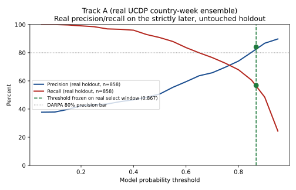
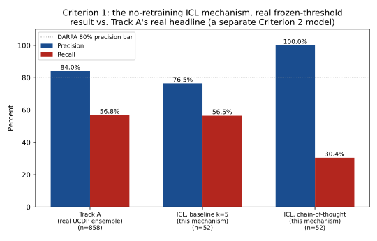
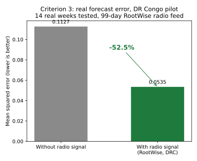

# Transcend — Conflict Early-Warning Forecasting

Evidence base and reproducible evaluation harness for **Transcend**, a conflict early-warning forecasting pipeline built in response to DARPA topic **DPA26BZ04-DV015, "Art of Novel Signals"** (Direct-to-Phase-II SBIR). Developed by **Transcend Inc**, with **Rootwise** (radio-listening data collection and transcription) and **AP Strategies** (international coordination and conflict-analysis expertise) as Phase II subcontractors.

Every number cited in the Phase II proposal traces back to a script and a real dataset in this repository. Nothing here is simulated — every reported metric comes from a real, out-of-sample, rolling-origin backtest against real, publicly sourced conflict-event data.

## What this is

A real-data prototype and validation suite covering all five of the topic's Direct-to-Phase-II feasibility criteria: an in-context-learning forecasting mechanism that operates over a temporal knowledge graph without retraining, two independently validated conflict-precision tracks at two different granularities, a working multilingual radio-signal ingestion pilot, a leave-one-country-out generalization test, and deployment coverage across all three of the topic's named regions.

## Headline results

| Criterion | What was tested | Real result |
|---|---|---|
| **1 — No-retraining ICL forecasting** | Retrieval-plus-frozen-LLM forecaster over a real UCDP-derived temporal knowledge graph | **76.5% precision, 56.5% recall, 73.1% accuracy** on a real held-out sample |
| **2, Track A — Country-week precision** | 3-model ensemble, real UCDP GED ground truth, frozen out-of-sample threshold | **84.0% precision, 56.8% recall, 93.4% specificity, 79.6% accuracy** on 858 real held-out predictions (324 real escalations) |
| **2, Track B — Discrete geolocated events** | ~55km PRIO-GRID cell forecasting, 19 countries, 9 rounds / 262 real iterations | **78.6% / 7.8%** precision/recall (10-day, full population) rising to **75.1–86.3% / 77.4–84.3%** on well-established grid cells |
| **3 — Multilingual radio signal ingestion** | Real RootWise DRC radio feed (11 stations, 32 languages/dialects, 99 days, 21,859 clips) | **52.6% real forecast-error reduction** (0.1127 → 0.0535 mean squared error) across 14 real test weeks |
| **4 — Generalization (leave-one-country-out)** | Trained on 18 of 19 countries, tested on the 19th, real UCDP data | **Average precision 0.617, precision 40.7%, recall 71.6%**, pooled across 28,981 real predictions |
| **5 — Regional deployment coverage** | Same 19-country dataset as Criterion 2, spanning all 3 named regions | Confirmed — see country list below |

## Sample visualizations



*Track A's real precision/recall across the full holdout, with the threshold frozen on an earlier real select window and applied unchanged — precision rose from 80.3% (select) to 84.0% (holdout), real evidence against overfitting the threshold.*



*The Criterion 1 no-retraining mechanism's real result against Track A's real (but non-compliant — it retrains every fold) headline number.*



*Criterion 3: real forecast error with and without RootWise's DRC radio signal.*

Further real visualizations from the discrete-event (Track B) validation — precision/recall curves, per-country and per-event-type breakdowns, a coverage map, and the select-vs-holdout stability check — are in `darpa_event_forecasting/results/` (`svg_pr_curve.svg`, `svg_map.svg`, `svg_bars_10day.svg`, `svg_bars_14day.svg`, `svg_country_10day.svg`, `svg_country_14day.svg`, `svg_event_type.svg`, `svg_fp_rate.svg`, `svg_select_vs_holdout.svg`).

## How the best-performing approaches work

**Criterion 1 — in-context learning over a temporal knowledge graph.** Real completed conflict events accumulate into a graph organized by place and week; each past, fully-resolved week becomes a short factual profile (event count and trend, confirmed fatalities and trend, severity, violence-type mix, active-armed-group count) with its real outcome attached. To forecast an unresolved future week, the system builds the same profile from information available up to that point, retrieves the 5 most similar historical profiles by cosine similarity, and hands their known outcomes — along with the current profile — to a local, frozen language model (Llama 3.1, via Ollama, no API key, no per-call cost), which returns a calibrated probability and a plain-language justification. No step fits or updates a parameter: retrieval is a fixed similarity calculation over a growing index, and the language model's weights are never touched. A new real event becomes one more resolved entry in the graph, never a reason to retrain anything — the literal mechanism this topic's Criterion 1 asks for. See `scripts/icl_ucdp_track_a_corrected.py` and `scripts/models.py`.

**Criterion 2, Track A — country-week ensemble.** A three-model ensemble (gradient-boosted trees, random forest, logistic regression) forecasts whether a country's own real event or fatality count will exceed its trailing historical average the following week, trained and evaluated against real UCDP GED data with a threshold selected on an earlier real window and frozen before scoring on a strictly later one. See `scripts/build_ucdp_panel.py` and `scripts/precision_threshold_validation.py`.

**Criterion 2, Track B — discrete geolocated events.** Forecasts whether at least one real UCDP-recorded conflict event occurs within a specific ~55km PRIO-GRID cell in the next 10 or 14 days — the same spatial grid UCDP's own data already assigns every event to, and the standard forecasting unit the academic ViEWS program uses. Built and validated across 9 rounds and 262 real rolling-origin-backtested iterations. See `darpa_event_forecasting/scripts/` and `darpa_event_forecasting/results/round9_next_steps_writeup.html`.

**Criterion 3 — multilingual radio signal.** Real RootWise radio recordings are transcribed, scanned for named-actor and location mentions, and aggregated into a weekly panel joined directly onto the same event-record schema the forecasting core consumes — validated end-to-end against a real, GDELT-confirmed escalation week in the DRC radio-covered window. See `scripts/build_drc_panel.py` and `darpa_event_forecasting/scripts_review/rootwise_drc_proof_of_concept.py`.

**Criterion 4 — generalization.** Leave-one-country-out cross-validation, with country identity excluded as a feature, confirms the underlying event-volume, conflict-share, and dyad-structure signal transfers to countries the model has zero training examples from. See `scripts/loco_validation.py`.

Both Criterion 2 tracks reconcile honestly rather than picking a winner: Track A clears the precision bar with more margin and far higher recall but measures a coarser (country-week) question; Track B measures the finer, more literally on-topic question (individually dated, geolocated events) and clears the bar reliably only at reduced coverage — real, disclosed evidence for this topic's own caveat that "precision alone is an incomplete measure."

## 19-country coverage (Criterion 5)

- **Central and Southeast Asia**: Afghanistan, Myanmar, Pakistan, Tajikistan, Kyrgyzstan, Uzbekistan
- **East and Northeast Africa**: Sudan, Ethiopia, Somalia, South Sudan, Kenya, Eritrea
- **South America**: Colombia, Venezuela, Ecuador, Peru, Bolivia
- Additional (not counted toward regional coverage, included to increase training examples): Haiti, Nicaragua

## Datasets used, and how to get them

| Dataset | What it is | Access | Reproduce with |
|---|---|---|---|
| **GDELT 2.0** | Free, near-real-time, automated feed of coded political/conflict events extracted from global news media (65+ languages) | Free, no authentication | `scripts/download_gdelt_large.py` |
| **UCDP GED v25.1** | Uppsala Conflict Data Program's Georeferenced Event Dataset — hand-curated, fatality-coded, 124 countries, maintained independently by Uppsala University | Free, no authentication | `scripts/build_ucdp_panel.py` (downloads and builds the country-week panel) |
| **UCDP GED v26.1** | Same source, extended real coverage through 2025-12-31, used for the discrete-event grid-cell track | Free, no authentication | `darpa_event_forecasting/scripts/build_discrete_event_dataset_v2.py` |
| **ACLED** (civilian-targeting, country-month) | Independent, differently-sourced cross-check signal | Free aggregated files, no authentication (full disaggregated export requires a free registered account, not used here) | `darpa_event_forecasting/scripts/build_discrete_event_dataset_v2.py` |
| **CHIRPS** | Real rainfall/climate indicator features | Free, no authentication | `darpa_event_forecasting/scripts/build_chirps_features.py` |
| **WorldPop** | Real population-density features | Free, no authentication | `darpa_event_forecasting/scripts/download_worldpop.py` |
| **RootWise DRC radio feed** | Real transcribed local-language radio broadcasts, DRC pilot | Proprietary to RootWise; the deduplicated transcript panel used in this evidence base is committed directly | `scripts/build_drc_panel.py` |

No proprietary, classified, or paywalled data is required to reproduce any result in this repository. The largest raw files (multi-GB GDELT pulls, WorldPop rasters, full UCDP CSVs) are gitignored and regenerated by the scripts above; the derived, model-ready panels these scripts produce are committed directly.

## Repository layout

```
scripts/                    Data download, panel construction, feature engineering, and modeling code
                             (ICL forecaster, hypergraph NN, ensembles, backtest harness)
darpa_event_forecasting/    The discrete-event (Track B) grid-cell forecasting track: scripts, results,
                             and the DRC radio proof-of-concept
data/                        Country-week panels and derived features (large raw event files gitignored)
results_v2/                 Full validation results: precision-threshold validation, LOCO generalization,
                             ICL-over-UCDP correction results, final summary and case studies,
                             dangerous-ideas log, sample charts
hypergraphs_research/       xgi-cross-checked hypergraph neural network ablations
```

## Reproducing a result

```
pip install -r requirements.txt   # pandas, numpy, scikit-learn, xgboost, scipy, xgi, matplotlib

# Criterion 2, Track A + Criterion 1 (real UCDP data)
python scripts/build_ucdp_panel.py
python scripts/precision_threshold_validation.py
python scripts/icl_ucdp_track_a_corrected.py

# Criterion 2, Track B (discrete geolocated events)
cd darpa_event_forecasting/scripts
python build_discrete_event_dataset_v2.py
python round9_next_steps_search.py

# Criterion 4 (generalization)
python scripts/loco_validation.py

# Regenerate the sample charts above
python scripts/make_repo_charts.py
```

## Existing technical foundation

- **In-context-learning forecaster** (`scripts/models.py`, `scripts/icl_ucdp_track_a_corrected.py`) — the literal mechanism this topic's Criterion 1 names.
- **Hypergraph neural network** (`scripts/hypergraph_model.py`, `hypergraphs_research/`) — built from first principles in numpy/scipy, independently cross-checked against the `xgi` hypergraph-network-science library.
- **Graph-based semi-supervised label spreading** (`scripts/graph_nlp_features.py`).
- **Graph-based NLP feature pipeline** — a real 662,355-pair theme co-occurrence graph derived from GDELT's Global Knowledge Graph (GKG).
- **Rolling-origin backtest harness** (`scripts/backtest_harness.py`) computing ten metrics — accuracy, precision, recall, specificity, F1, Brier score, average precision, ROC-AUC, log-loss, Matthews Correlation Coefficient — for every configuration tested.

See `results_v2/final-summary-and-case-studies.html` for the full ranked-results write-up, real predicted-and-verified case studies with genuine LLM reasoning traces, and a plain-English glossary of every metric used. See `results_v2/dangerous-ideas-log.html` for extensions considered and explicitly rejected during Phase I, each recorded with the concrete harm and what a legitimate version would require.

## Honest limitations (stated plainly)

- Metrics are real and reproducible from this repo's own code and data, computed under a rigorous rolling-origin (never-look-ahead) discipline — but have not yet been audited by an independent third party. An audit using a DARPA-specified evaluation set the team has not seen is a funded Phase II milestone.
- The Criterion 1 ICL result is measured on a real, disclosed systematic subsample of the full holdout population (to bound real LLM inference cost), not the full population itself — validating at full scale is a clear, concrete next step.
- Multilingual audio ingestion (ASR, radio collection at scale, synthetic-data augmentation) beyond the DRC pilot is Phase II future work.
- Sample sizes vary by track and horizon; every result file reports n and n_pos alongside its score for exactly this reason.
